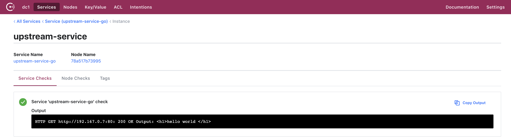
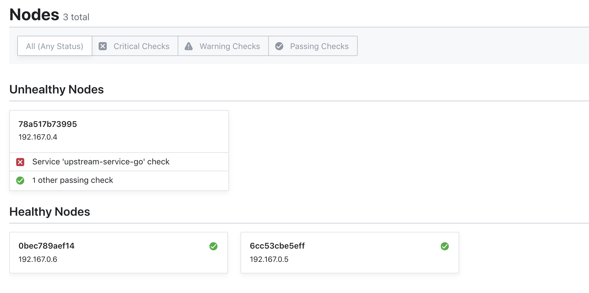

# orange-docker

orange-base dockerfile, include orange/mysql/consule/upstream-services

## Depend on

- [Orange](https://github.com/orlabs/orange)
- [UpStreamServices](https://github.com/whiteCcinn/dispatcher-misc)

## Usage

## Base

```
cp -v env.example .env
cd orange/src && git clone https://github.com/orlabs/orange.git && cd -
cd upstream-services/src/ && git clone https://github.com/whiteCcinn/dispatcher-misc.git && cd -

docker network create --driver=bridge --subnet=192.167.0.0/24 orange_docker_ord-network
docker-compose up
```

## Register Upstream Service

### Non-invasive registration

```
curl \
    --request PUT \
    --data @upstream-services/register/register.json \
    http://127.0.0.1:8508/v1/agent/service/register
```




### Simulated upstream death

```
docker kill upstream-service
```




## Orange Dashboard


